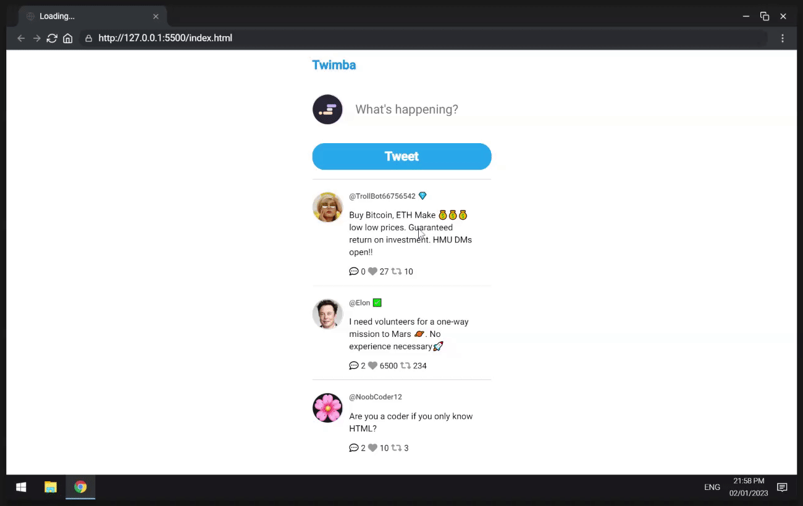

# Scrimba - Module 5: Essential JavaScript Concepts - Twimba: Twitter Clone

This is a follow-along solution to [Scrimba - Module 5: Essential JavaScript Concepts - Twimba: Twitter Clone](https://scrimba.com/playlist/p5PpdAw) practice project.

## Quick start:

<!-- ```
$ npm install
$ npm start
```` -->

Head over to https://vitejs.dev/ to learn more about using vite

## About Scrimba

At Scrimba our goal is to create the best possible coding school at the cost of a gym membership! 💜
If we succeed with this, it will give anyone who wants to become a software developer a realistic shot at succeeding, regardless of where they live and the size of their wallets 🎉
The Frontend Developer Career Path aims to teach you everything you need to become a Junior Developer, or you could take a deep-dive with one of our advanced courses 🚀

- [Our courses](https://scrimba.com/allcourses)
- [The Frontend Career Path](https://scrimba.com/learn/frontend)
- [Become a Scrimba Pro member](https://scrimba.com/pricing)

Happy Coding!

## Table of contents

- [Scrimba - Module 5: Essential JavaScript Concepts - Twimba: Twitter Clone](#scrimba---module-5-essential-javascript-concepts---twimba-twitter-clone)
  - [Quick start:](#quick-start)
  - [About Scrimba](#about-scrimba)
  - [Table of contents](#table-of-contents)
  - [Overview](#overview)
    - [Learning objectives](#learning-objectives)
    - [Screenshot](#screenshot)
    - [Links](#links)
  - [My process](#my-process)
    - [Built with](#built-with)
  - [Author](#author)

## Overview

### Learning objectives

What will be learned while following along with this practice project:
- .forEach()
- CDNs
  - add icons
  - generate UUIDs
- textarea
- data attributes
- conditionally render styles
- NOT operator (!)

### Screenshot



### Links

- Solution URL: [Github Repo](https://github.com/varonalearns/Twitter-Clone)
- Live Site URL: [Netlify Live Site](https://jazzy-marzipan-8ecf9f.netlify.app/)

## My process

### Built with

- Semantic HTML5
- CSS custom properties
- Vanilla JavaScript

## Author

- Website - [Evalia Varona](https://www.evaliavarona.com)
- Hashnode - [@evavarona](https://evaliavarona.hashnode.dev)
